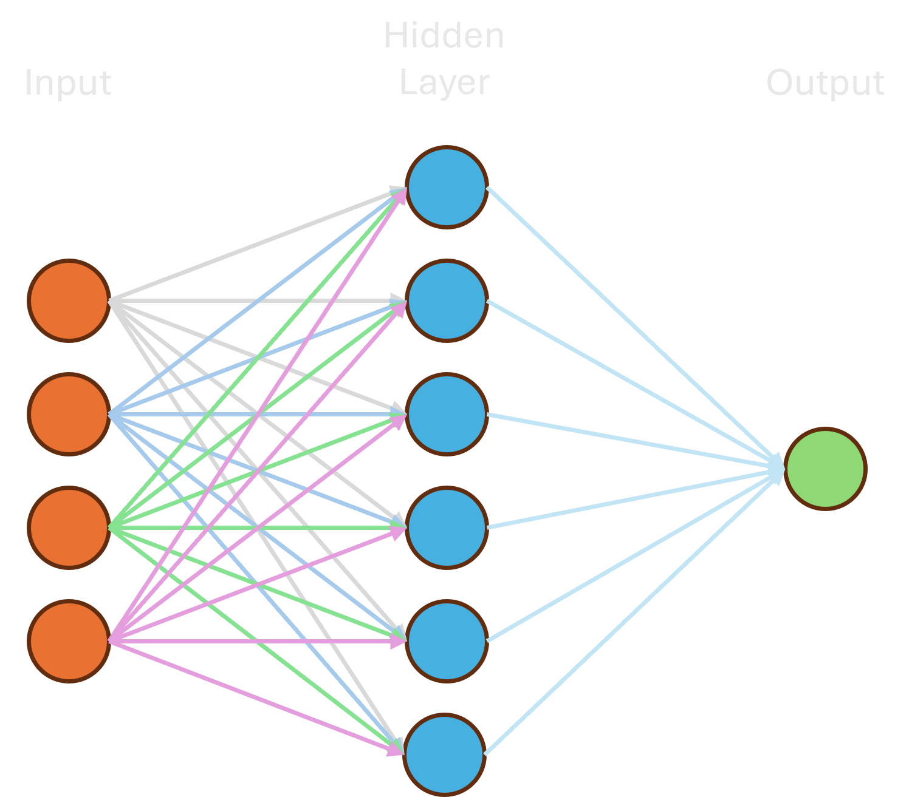
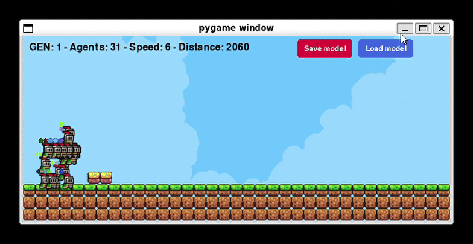

# 👟 Neuro Runner

I developed this project to learn the implementation of genetic/evolutionary AI using a simple game to create the test environment.

## Resources

- Python
- PyGame
- PyTorch

 

          

 

## What is Genetic/Evolutionary AI?

Genetic/Evolutionary AI is inspired by biological evolution to solve complex problems. It maintains a population of candidate solutions and, at each generation, evaluates the **"fitness""** of each solution. The fittest solutions have a greater chance of **"reproducing"** (combining their characteristics) and undergoing small "mutations", generating new solutions. This process repeats itself, seeking increasingly better solutions over generations, similar to natural selection. Genetic algorithms are the most common example of this approach.

## 🧠 Model

This neural network is like a small digital brain. It receives 4 pieces of information, which are processed by 6 "thinkers" (neurons) in a hidden layer, and delivers a final result based on this analysis. It is a simple system that learns to give answers from data.

  

## 🎮 Example

## 🧪 Test/Run Project

Make sure you have the required packages installed:

- PyGame
- PyTorch

Enter the folder `src` and run command `python3 main.py`
